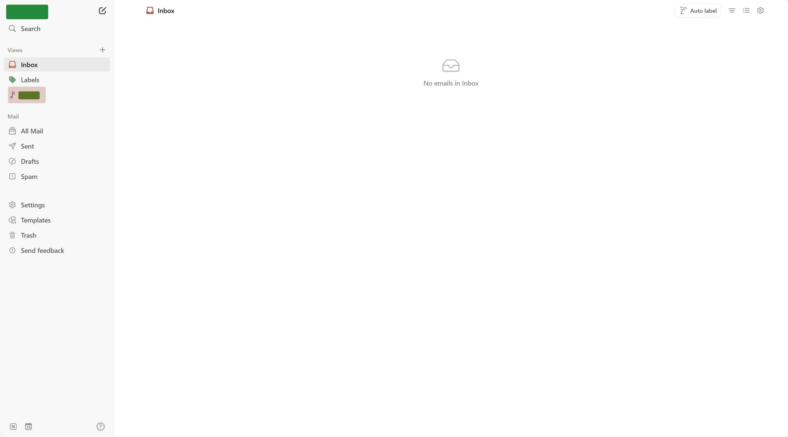

## 初见

不知道什么时候申请的 Notion Mail Waitlist 通过了。据官方介绍，有重点邮件标记、重复插入文字片段、AI 整理邮件功能。

登陆后是入下的界面，布局和 Notion 基本是一模一样了。编辑器和 Notion 相似，通过 `/` 可以唤起命令，包括格式（Heading）和插入 snippets（预定义的文字片段）。

和 Gmail 的结合做的挺好，在 Gmail 里可用的发件人在 Notion Mail 里都可用。左侧 Labels 里是 Gmail 里已有的标签。

右上角有一个 Auto Label 功能。点开后可以输入关键词。

输入关键词后 AI 会自动帮你搜索所有的邮件，抽出相关的邮件生成一个新的标签。不过它只会归类最近的十几封邮件，更远的不会自动归类了。

Notion Mail 中新生成的标签会在左侧边栏单独占位，和 Notion 中的 Page 一样，可以更换 emoji。这个新添加的标签在 Gmail 里也可以看到。

自动标出重点邮件的功能因为 Inbox 现在没几封邮件还没法测试。

## 总结

界面和 Notion 很像，做的很好看。和 Gmail 的整合也做的不错。

但是没有 AI draft 的功能，Gmail 里的 AI draft 实在是太方便了，而且还免费。

仅有目前的功能很难说服我放弃 Gmail 迁移到 Notion Mail。