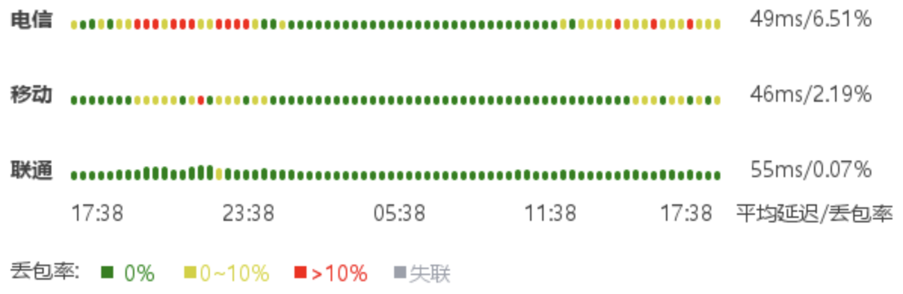

## 简评

搬瓦工 46 刀套餐可切换的软银机房，每月 500 G 双向流量，三网回程软银，电信去程 CN2，三网可用的 VPS。

## IP 质量

只给一个 ipv4 地址，质量一般。

```
########################################################################
一、基础信息（Maxmind 数据库）
自治系统号：            AS25820
组织：                  IT7NET
坐标：                  135°30′2″E, 34°41′35″N
地图：                  https://check.place/34.693,135.5005,15,cn
城市：                  Osaka, Osaka, 543-0062
使用地：                [JP]日本, [AS]亚洲
注册地：                [CA]加拿大
时区：                  Asia/Tokyo
IP类型：                 广播IP 
二、IP类型属性
数据库：      IPinfo    ipregistry    ipapi     AbuseIPDB  IP2LOCATION 
使用类型：     机房        机房        家宽        机房        机房    
公司类型：     机房        机房        家宽    
三、风险评分
风险等级：      极低         低       中等       高         极高
SCAMALYTICS：  0|低风险
ipapi：                            2.04%|较高风险
AbuseIPDB：    0|低风险
IPQS：                                                      100|高风险
Cloudflare：   0|低风险
DB-IP：         |低风险
四、风险因子
库： IP2LOCATION ipapi ipregistry IPQS SCAMALYTICS ipdata IPinfo IPWHOIS
地区：    [JP]    [JP]    [JP]    [JP]    [JP]    [JP]    [JP]    [JP]
代理：     否      否      否      是      否      否      否      是 
Tor：      否      否      否      否      否      否      否      否 
VPN：      是      是      是      是      否      无      否      否 
服务器：   是      否      是      无      否      否      是      是 
滥用：     否      否      否      是      无      否      无      无 
机器人：   否      否      无      是      否      无      无      无 
五、流媒体及AI服务解锁检测
服务商：  TikTok   Disney+  Netflix Youtube  AmazonPV  Spotify  ChatGPT 
状态：     解锁     屏蔽    仅自制    解锁     解锁     屏蔽     解锁   
地区：     [JP]              [JP]     [JP]     [JP]              [JP]   
方式：     原生              原生     原生     原生               DNS   
六、邮局连通性及黑名单检测
本地25端口：阻断
IP地址黑名单数据库：  有效 439   正常 425   已标记 14   黑名单 0
========================================================================
```

```
============[ Multination ]============
 Dazn:                                  Failed (Error: )
 Disney+:                               No (IP Banned By Disney+ 1)
 Netflix:                               Originals Only
 YouTube Premium:                       Yes (Region: JP)
 Amazon Prime Video:                    Yes (Region: JP)
 TVBAnywhere+:                          Yes
 Spotify Registration:                  No
 OneTrust Region:                       JP [Osaka]
 iQyi Oversea Region:                   JP
 Bing Region:                           JP (Risky)
 Apple Region:                          JP
 YouTube CDN:                           Osaka
 Netflix Preferred CDN:                 Osaka
 ChatGPT:                               Yes
 Google Gemini:                         Yes (Region: JPN)
 Claude:                                Yes
 Wikipedia Editability:                 No
 Google Play Store:                     Japan 
 Google Search CAPTCHA Free:            Yes
 Steam Currency:                        JPY
 ---Forum---
 Reddit:                                No
=======================================
===============[ Japan ]===============
 DMM:                                   Yes
 DMM TV:                                No
 Abema.TV:                              No
 Niconico:                              No (Official Live Unavailable. LiveID: lv346574661)
 Telasa:                                Yes
 U-NEXT:                                Yes
 Hulu Japan:                            No
 TVer:                                  Yes
 Lemino:                                No
 AnimeFesta:                            No
 WOWOW:                                 No
 VideoMarket:                           Yes
 D Anime Store:                         No
 FOD(Fuji TV):                          Yes
 Radiko:                                Yes (City: TOKYO)
 Karaoke@DAM:                           Yes
 J:com On Demand:                       Yes
 WATCHA:                                Yes
 Rakuten TV JP:                         No
 ---Game---
 Kancolle Japan:                        Yes
 Pretty Derby Japan:                    Failed (Network Connection)
 Konosuba Fantastic Days:               Yes
 Princess Connect Re:Dive Japan:        Failed (Network Connection)
 Project Sekai: Colorful Stage:         No
 ---Music---
 Mora:                                  Yes
 music.jp:                              No
 ---Forum---
 EroGameSpace:                          Failed (Network Connection)
=======================================
```

## 线路

24 小时延迟丢包如下（from vps789.com）：



三网回程软银：

```
---------------------回程路由--感谢fscarmen开源及PR---------------------
依次测试电信/联通/移动经过的地区及线路，核心程序来自nexttrace，请知悉!
上海电信 202.96.209.133
34.04 ms        * RFC1918
19.25 ms        AS4785 [XTOM] 日本 大阪府 大阪 xtom.com
1.11 ms         AS4785 [OWL-JP] 日本 大阪府 大阪 xtom.com
1.52 ms         AS4785 [OWL-JP] 日本 大阪府 大阪 xtom.com
0.76 ms         AS17676 [JPNIC-NET] 日本 大阪府 大阪 softbank.jp
1.69 ms         AS17676 [JPNIC-NET] 日本 大阪府 大阪 softbank.jp
37.31 ms        AS17676 [BBTEC] 中国 上海 softbank.jp
45.97 ms        AS4134 [CHINANET-BB] 中国 上海 www.chinatelecom.com.cn 电信
45.80 ms        AS4134 [CHINANET-BB] 中国 上海 www.chinatelecom.com.cn 电信
67.53 ms        AS4812 中国 上海 青浦 chinatelecom.cn
45.13 ms        AS4812 [CHINANET-SH] 中国 上海 chinatelecom.cn 电信
上海联通 210.22.97.1
33.15 ms        * RFC1918
9.59 ms         AS4785 [XTOM] 日本 大阪府 大阪 xtom.com
1.58 ms         AS4785 [OWL-JP] 日本 大阪府 大阪 xtom.com
7.49 ms         AS4785 [OWL-JP] 日本 大阪府 大阪 xtom.com
0.68 ms         AS17676 [JPNIC-NET] 日本 大阪府 大阪 softbank.jp
1.70 ms         AS17676 [JPNIC-NET] 日本 大阪府 大阪 softbank.jp
59.03 ms        AS17676 [BBTEC] 中国 北京 BBTEC-CU-Peer softbank.jp
59.56 ms        AS4837 [CU169-BACKBONE] 中国 北京 chinaunicom.cn
58.68 ms        AS17621 [CNCNET-SH] 中国 上海 闵行区 chinaunicom.cn 联通
上海移动 211.136.112.200
34.79 ms        * RFC1918
17.93 ms        AS4785 [XTOM] 日本 大阪府 大阪 xtom.com
1.78 ms         AS17676 [JPNIC-NET] 日本 大阪府 大阪 softbank.jp
1.69 ms         AS17676 [JPNIC-NET] 日本 大阪府 大阪 softbank.jp
7.82 ms         AS17676 [BBTEC] 日本 东京都 东京 softbank.jp
62.07 ms        AS9808 [CMNET] 中国 上海 X-I chinamobileltd.com 移动
83.23 ms        AS9808 [CMNET] 中国 上海 I-C chinamobileltd.com 移动
80.40 ms        AS9808 [CMNET] 中国 上海 chinamobileltd.com 移动
83.41 ms        AS24400 [CMNET] 中国 上海 sh.10086.cn 移动
86.06 ms        AS24400 [CMNET] 中国 上海 浦东新区 sh.10086.cn 移动
------------------------------------------------------------------------
```