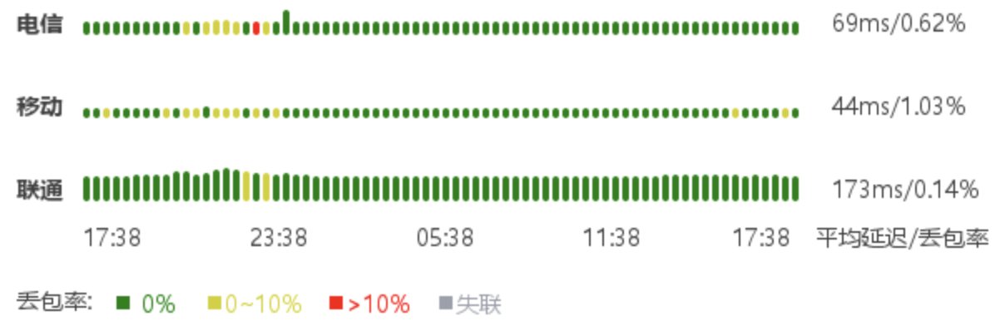

## 简评

Claw 1 月活动时推出的老 7 刀 VPS，第一年 7 刀，续费 36 刀，每月 500 G 单向流量，电信移动软银直连，联通绕美。因为用的人有点多，偶尔会爆炸。

## IP 质量

给一个 ipv4 和一个 ipv6 地址，IP 都很脏，连看 YouTube 都有可能被验证。解锁那更是几乎没有。

### ipv4

```
########################################################################
一、基础信息（IPinfo 数据库）
自治系统号：            ASAS45102
组织：                  Alibaba (US) Technology Co., Ltd.
坐标：                  139°41′30″E, 35°41′22″N
地图：                  https://check.place/35.6895,139.6917,12,cn
城市：                  Tokyo, 101-8656
使用地：                [JP]Japan, Asia
注册地：                [US]United States of America
IP类型：                 广播IP 
二、IP类型属性
数据库：      IPinfo      ipapi    IP2LOCATION 
使用类型：     机房        机房        机房    
公司类型：     机房        机房    
三、风险评分
风险等级：      极低         低       中等       高         极高
SCAMALYTICS：  0|低风险
ipapi：          0.35%|低风险
Cloudflare：   0|低风险
DB-IP：         |低风险
四、风险因子
库： IP2LOCATION ipapi SCAMALYTICS IPinfo IPWHOIS
地区：    [JP]    [JP]    [JP]    [JP]    [JP]
代理：     否      否      否      否      否 
Tor：      否      否      否      否      否 
VPN：      否      是      否      否      否 
服务器：   是      是      否      是      是 
滥用：     否      否      无      无      无 
机器人：   否      否      否      无      无 
五、流媒体及AI服务解锁检测
服务商：  TikTok   Disney+  Netflix Youtube  AmazonPV  Spotify  ChatGPT 
状态：     解锁     屏蔽    仅自制    解锁     解锁     屏蔽     解锁   
地区：     [JP]              [US]     [JP]     [JP]              [JP]   
方式：     原生              原生     原生     原生              原生   
六、邮局连通性及黑名单检测
本地25端口：阻断
IP地址黑名单数据库：  有效 439   正常 427   已标记 12   黑名单 0
========================================================================
```

```
============[ Multination ]============
 Dazn:                                  Failed (Error: )
 Disney+:                               No (IP Banned By Disney+ 1)
 Netflix:                               Originals Only
 YouTube Premium:                       Yes (Region: JP)
 Amazon Prime Video:                    Yes (Region: JP)
 TVBAnywhere+:                          Yes
 Spotify Registration:                  No
 OneTrust Region:                       JP [Tokyo]
 iQyi Oversea Region:                   JP
 Bing Region:                           JP (Risky)
 Apple Region:                          JP
 YouTube CDN:                           Failed (Network Connection)
 Netflix Preferred CDN:                 Tokyo
 ChatGPT:                               Yes
 Google Gemini:                         Yes (Region: JPN)
 Claude:                                Yes
 Wikipedia Editability:                 No
 Google Play Store:                     Japan 
 Google Search CAPTCHA Free:            Yes
 Steam Currency:                        JPY
 ---Forum---
 Reddit:                                No
=======================================
===============[ Japan ]===============
 DMM:                                   Yes
 DMM TV:                                No
 Abema.TV:                              No
 Niconico:                              No (Official Live Unavailable. LiveID: lv346722971)
 Telasa:                                No
 U-NEXT:                                Yes
 Hulu Japan:                            No
 TVer:                                  No
 Lemino:                                No
 AnimeFesta:                            No
 WOWOW:                                 No
 VideoMarket:                           Yes
 D Anime Store:                         No
 FOD(Fuji TV):                          No
 Radiko:                                No
 Karaoke@DAM:                           No
 J:com On Demand:                       Yes
 WATCHA:                                Yes
 Rakuten TV JP:                         No
 ---Game---
 Kancolle Japan:                        No
 Pretty Derby Japan:                    Failed (Network Connection)
 Konosuba Fantastic Days:               Yes
 Princess Connect Re:Dive Japan:        Failed (Network Connection)
 Project Sekai: Colorful Stage:         No
 ---Music---
 Mora:                                  Yes
 music.jp:                              No
 ---Forum---
 EroGameSpace:                          Failed (Network Connection)
=======================================
```

### ipv6

```
########################################################################
一、基础信息（IPinfo 数据库）
自治系统号：            ASAS45102
组织：                  Alibaba (US) Technology Co., Ltd.
坐标：                  139°41′30″E, 35°41′22″N
地图：                  https://check.place/35.6895,139.6917,12,cn
城市：                  Tokyo, 101-8656
使用地：                [JP]Japan, Asia
注册地：                [SG]Singapore
IP类型：                 广播IP 
二、IP类型属性
数据库：      IPinfo      ipapi    IP2LOCATION 
使用类型：     机房        机房        机房    
公司类型：     机房        机房    
三、风险评分
风险等级：      极低         低       中等       高         极高
SCAMALYTICS：             20|低风险
ipapi：    0.00%|极低风险
Cloudflare：   0|低风险
DB-IP：         |低风险
四、风险因子
库： IP2LOCATION ipapi SCAMALYTICS IPinfo IPWHOIS
地区：    [JP]    [JP]    [JP]    [JP]    [JP]
代理：     否      否      否      否      否 
Tor：      否      否      否      否      否 
VPN：      否      否      否      否      否 
服务器：   是      是      否      是      否 
滥用：     否      否      无      无      无 
机器人：   否      否      否      无      无 
五、流媒体及AI服务解锁检测
服务商：  TikTok   Disney+  Netflix Youtube  AmazonPV  Spotify  ChatGPT 
状态：     失败     屏蔽    仅自制    解锁     屏蔽     屏蔽     失败   
地区：                       [SG]     [JP]                              
方式：                       原生     原生                              
六、邮局连通性及黑名单检测
本地25端口：阻断
========================================================================
```

```
============[ Multination ]============
 Dazn:                                  IPv6 Is Not Currently Supported
 Disney+:                               IPv6 Is Not Currently Supported
 Netflix:                               Originals Only
 YouTube Premium:                       Yes (Region: JP)
 Amazon Prime Video:                    IPv6 Is Not Currently Supported
 TVBAnywhere+:                          IPv6 Is Not Currently Supported
 Spotify Registration:                  No
 OneTrust Region:                       JP [Tokyo]
 iQyi Oversea Region:                   IPv6 Is Not Currently Supported
 Bing Region:                           JP (Risky)
 Apple Region:                          JP
 YouTube CDN:                           Failed (Network Connection)
 Netflix Preferred CDN:                 Osaka
 ChatGPT:                               Failed (Network Connection)
 Google Gemini:                         No
 Claude:                                Yes
 Wikipedia Editability:                 No
 Google Play Store:                     Japan 
 Google Search CAPTCHA Free:            Yes
 Steam Currency:                        IPv6 Is Not Currently Supported
 ---Forum---
 Reddit:                                IPv6 Is Not Currently Supported
=======================================
===============[ Japan ]===============
 DMM:                                   IPv6 Is Not Currently Supported
 DMM TV:                                IPv6 Is Not Currently Supported
 Abema.TV:                              IPv6 Is Not Currently Supported
 Niconico:                              IPv6 Is Not Currently Supported
 Telasa:                                Yes
 U-NEXT:                                Yes
 Hulu Japan:                            IPv6 Is Not Currently Supported
 TVer:                                  IPv6 Is Not Currently Supported
 Lemino:                                No
 AnimeFesta:                            Failed (Network Connection)
 WOWOW:                                 IPv6 Is Not Currently Supported
 VideoMarket:                           IPv6 Is Not Currently Supported
 D Anime Store:                         IPv6 Is Not Currently Supported
 FOD(Fuji TV):                          IPv6 Is Not Currently Supported
 Radiko:                                IPv6 Is Not Currently Supported
 Karaoke@DAM:                           IPv6 Is Not Currently Supported
 J:com On Demand:                       Yes
 WATCHA:                                IPv6 Is Not Currently Supported
 Rakuten TV JP:                         IPv6 Is Not Currently Supported
 ---Game---
 Kancolle Japan:                        IPv6 Is Not Currently Supported
 Pretty Derby Japan:                    Failed (Network Connection)
 Konosuba Fantastic Days:               IPv6 Is Not Currently Supported
 Princess Connect Re:Dive Japan:        IPv6 Is Not Currently Supported
 Project Sekai: Colorful Stage:         IPv6 Is Not Currently Supported
 ---Music---
 Mora:                                  IPv6 Is Not Currently Supported
 music.jp:                              IPv6 Is Not Currently Supported
 ---Forum---
 EroGameSpace:                          IPv6 Is Not Currently Supported
=======================================
```

## 线路

24小时延迟及丢包（from vps789.com），意外的还行：



三网回程路由：

```
---------------------回程路由--感谢fscarmen开源及PR---------------------
依次测试电信/联通/移动经过的地区及线路，核心程序来自nexttrace，请知悉!
上海电信 202.96.209.133
1.42 ms         * DOD
51.92 ms        * DOD
1.48 ms         * RFC1918
3.23 ms         * RFC1918
2.31 ms         * 日本 东京都 东京
3.96 ms         * [BBIXINTLNET] 日本 东京都 东京 BBTEC-Peer
32.53 ms        AS17676 [BBTEC] 中国 上海 softbank.jp
70.43 ms        AS4812 [CHINANET-SH] 中国 上海 chinatelecom.cn 电信
33.28 ms        AS4812 [CHINANET-SH] 中国 上海 chinatelecom.cn 电信
上海联通 210.22.97.1
1.40 ms         * RFC1918
3.28 ms         * RFC1918
2.33 ms         * 日本 东京都 东京
4.38 ms         * [BBIXINTLNET] 日本 东京都 东京 BBTEC-Peer
169.34 ms       AS17676 [BBTEC] 中国 北京 BBTEC-CU-Peer softbank.jp
176.48 ms       AS17621 [CNCNET-SH] 中国 上海 闵行区 chinaunicom.cn 联通
上海移动 211.136.112.200
1.75 ms         * DOD
1.24 ms         * RFC1918
3.39 ms         * RFC1918
102.95 ms       * 日本 东京都 东京
4.05 ms         * [BBIXINTLNET] 日本 东京都 东京 BBTEC-Peer
4.32 ms         AS17676 [BBTEC] 日本 东京都 东京 softbank.jp
35.94 ms        AS58453 [CMI-INT] 中国 上海 CMI-CM-Peer cmi.chinamobile.com 移动
36.21 ms        AS9808 [CMNET] 中国 上海 X-I chinamobileltd.com 移动
88.22 ms        AS9808 [CMNET] 中国 上海 chinamobileltd.com 移动
39.90 ms        AS24400 [CMNET] 中国 上海 sh.10086.cn 移动
43.96 ms        AS24400 [CMNET] 中国 上海 浦东新区 sh.10086.cn 移动
------------------------------------------------------------------------
```