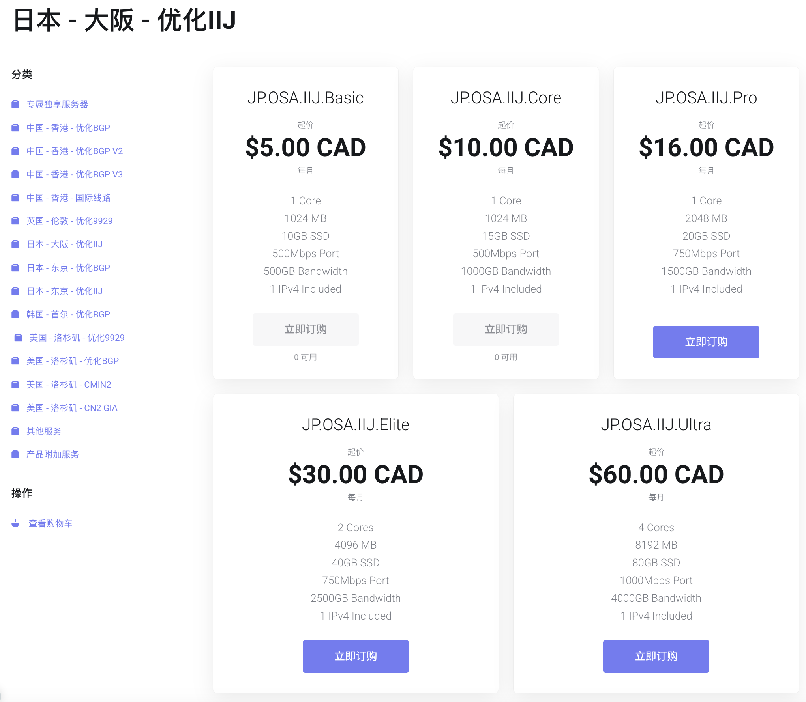
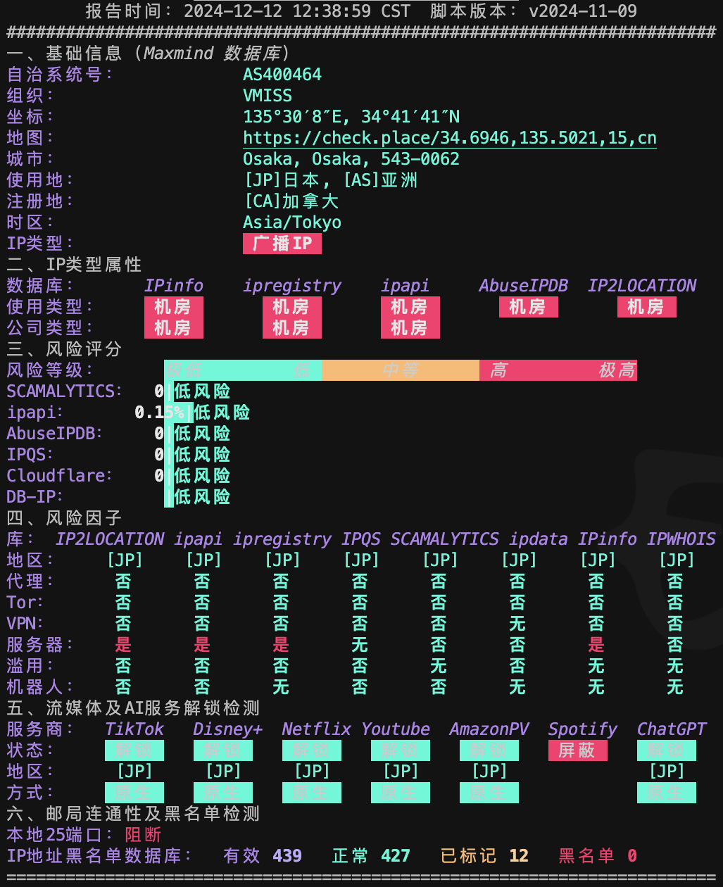

## 简评

Vmiss 日本大阪 IIJ VPS，起售价 5 加元，500G 流量双向计费，三网 IIJ 线路，配合八折优惠码 `20%off` 后，每月仅需 20 多元人民币，流量单价：12.5G/CNY， 性价比很高，IP 地址质量和线路都可以。



## IP 质量

虽然 IP 是广播IP，类型是机房，但非常干净，风险极低，几乎所有非强制点击的 Cloudflare 验证都可以直接跳过，无需手动点击验证。

大部分的日本 VPS 要么线路好 IP 不行，要么 IP 好线路不行，这一款算是 IP 和线路可以兼得的VPS了。

尽管 IP 地址干净，但大部分日本本地流媒体服务无法解锁，更适合用于日常上网和访问 ChatGPT 等服务。

### IP 质量检测



### IP 流媒体解锁检测

```yaml
============[ Multination ]============
 Dazn:                                  Yes (Region: JP)
 Disney+:                               Yes (Region: JP)
 Netflix:                               Yes (Region: JP)
 YouTube Premium:                       Yes (Region: JP)
 Amazon Prime Video:                    Yes (Region: JP)
 TVBAnywhere+:                          Yes
 Spotify Registration:                  No
 OneTrust Region:                       JP [Osaka]
 iQyi Oversea Region:                   JP
 Bing Region:                           JP
 YouTube CDN:                           Osaka
 Netflix Preferred CDN:                 Osaka
 ChatGPT:                               Yes
 Google Gemini:                         Yes (Region: JPN)
 Wikipedia Editability:                 Yes
 Google Play Store:                     Japan 
 Google Search CAPTCHA Free:            Yes
 Steam Currency:                        JPY
 ---Forum---
 Reddit:                                Yes
=======================================
===============[ Japan ]===============
 DMM:                                   Yes
 DMM TV:                                No
 Abema.TV:                              No
 Niconico:                              No (Official Live Unavailable. LiveID: lv345962889)
 Telasa:                                Yes
 U-NEXT:                                Yes
 Hulu Japan:                            No
 TVer:                                  Failed (Error: PAGE ERROR)
 Lemino:                                No
 AnimeFesta:                            No
 WOWOW:                                 No
 VideoMarket:                           Yes
 D Anime Store:                         No
 FOD(Fuji TV):                          No
 Radiko:                                No
 Karaoke@DAM:                           No
 J:com On Demand:                       Yes
 WATCHA:                                Yes
 Rakuten TV JP:                         No
 ---Game---
 Kancolle Japan:                        No
 Pretty Derby Japan:                    Yes
 Konosuba Fantastic Days:               Yes
 Princess Connect Re:Dive Japan:        Yes
 Project Sekai: Colorful Stage:         Yes
 ---Music---
 Mora:                                  Yes
 music.jp:                              No
 ---Forum---
 EroGameSpace:                          Failed (Network Connection)
=======================================
```